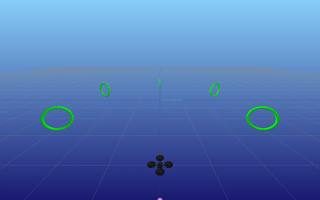
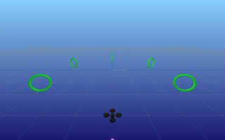
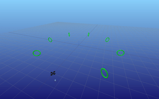
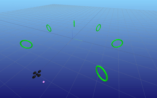

# CMU 16-745 Project: agile drone transportation


## Drone transportation task with optimal control

 | Standard Policy | Aggresive Policy |
 | --- | --- |
 |  |  |
 |  |  |


 ## Usage

```bash
cd notebook
# dense solver
julia main.jl
# sparse solver (recommended)
julia main_sparse.jl
```